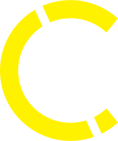

# Charles Van Hook - Engineering Portfolio

<div align="center">
  
  
  <h3>🚀 Interactive Portfolio Showcasing Robotics & Engineering Projects</h3>
  
  <p>
    
    
    
    
    
  </p>
</div>

---

## 📸 Screenshots

### 🏠 Homepage
<!-- Add your homepage screenshot here -->


### 🤖 Interactive 3D Robot
<!-- Add your 3D robot interaction screenshot here -->


### 📱 Responsive Design
<!-- Add your mobile/tablet screenshots here -->


### 🎯 Projects Section
<!-- Add your projects showcase screenshot here -->


### Custom Loading Screen


---

## ✨ Features

- **🎭 Interactive 3D Robot**: Animated 3D model that responds to mouse movement using Three.js
- **📱 Fully Responsive**: Optimized for desktop, tablet, and mobile devices
- **🎨 Modern UI/UX**: Smooth animations powered by GSAP and Framer Motion
- **⚡ Performance Optimized**: Built with Next.js for optimal loading speeds
- **🎯 Project Showcase**: Detailed portfolio of robotics and engineering projects
- **📧 Contact Integration**: EmailJS integration for seamless communication
- **🎵 Audio Integration**: Sound effects using Howler.js
- **🔄 Real-time Updates**: Dynamic content loading and state management

---

## 🛠️ Tech Stack

### Frontend Framework
<div align="center">
  
  
</div>

### Styling & Animation
<div align="center">
  
  
  
  
</div>

### 3D Graphics & Visualization
<div align="center">
  
  
  
</div>

### Development Tools
<div align="center">
  
  
  
</div>

### Additional Libraries
<div align="center">
  
  
  
  
</div>

---

## 🚀 Getting Started

### Prerequisites
- Node.js 16 or higher
- Yarn package manager

### Installation

1. **Clone the repository**
   ```bash
   git clone https://github.com/yourusername/portfolio.git
   cd portfolio
   ```

2. **Install dependencies**
   ```bash
   yarn install
   ```

3. **Run the development server**
   ```bash
   yarn dev
   ```

4. **Open your browser**
   Navigate to [`http://localhost:3000`](http://localhost:3000) to view the application.

### Available Scripts

- `yarn dev` - Starts the development server
- `yarn build` - Builds the application for production
- `yarn start` - Starts the production server
- `yarn lint` - Runs ESLint for code quality

---

## 📁 Project Structure

```
portfolio/
├── components/          # React components
│   ├── Button/         # Reusable button component
│   ├── Card/           # Card components
│   ├── Contact/        # Contact form
│   ├── Header/         # Navigation and menu
│   ├── Hero/           # Hero section with 3D robot
│   ├── Projects/       # Project showcase
│   ├── Skills/         # Skills section
│   └── ...
├── pages/              # Next.js pages
│   ├── api/            # API routes
│   ├── projects/       # Individual project pages
│   └── ...
├── public/             # Static assets
│   ├── projects/       # Project images and media
│   ├── skills/         # Technology icons
│   └── ...
├── styles/             # Global styles
└── ...
```

---

## 🎯 Key Projects Showcased

### 🤖 Hexapod Robot
- **Description**: Robotic Hexapod with AI Controlled Arm
- **Technologies**: Python, Fusion 360, C++, OpenCV, Arduino
- **Features**: Autonomous movement, computer vision integration

### 🗺️ LiDaR Robot
- **Description**: Nvidia Jetson Controlled Robot with Autonomous Mapping and Navigation
- **Technologies**: Fusion 360, ROS, NVIDIA Jetson, C++
- **Features**: SLAM navigation, real-time mapping

### 🦾 Robotic Arm
- **Description**: 3D Printed 8DOF Robotic Arm with ROS MoveIt controls
- **Technologies**: Fusion 360, ROS, C++
- **Features**: Inverse kinematics, trajectory planning

### ♟️ AI Chessboard
- **Description**: AI Controlled Chessboard that Emulates Players
- **Technologies**: Fusion 360, Altium Designer, C++
- **Features**: Computer vision, move validation

---

## 🎨 Design Features

- **Smooth Animations**: GSAP-powered scroll animations and transitions
- **Interactive Elements**: Hover effects, tilt animations, and micro-interactions
- **3D Integration**: Three.js-powered 3D robot model with mouse tracking
- **Responsive Layout**: Mobile-first design with Tailwind CSS
- **Performance Optimized**: Image optimization and lazy loading
- **Accessibility**: ARIA labels and keyboard navigation support

---

## 📄 License

This project is licensed under the MIT License - see the [LICENSE](LICENSE) file for details.

---

<div align="center">
  <p>Made with ❤️ by Charles Van Hook</p>
  <p>⭐ Star this repository if you found it helpful!</p>
</div>
